- [eheat](#eheat)
  - [Installation](#installation)
  - [`ggheat`](#ggheat)
  - [`gganno`](#gganno)
  - [`anno_gg` and `anno_gg2`](#anno_gg-and-anno_gg2)
  - [Session information](#session-information)

<!-- README.md is generated from README.Rmd. Please edit that file -->

# eheat

<!-- badges: start -->

[](https://github.com/Yunuuuu/eheat/actions/workflows/R-CMD-check.yaml)
<!-- badges: end -->

*Read this in other languages: [English](README.md),
[简体中文](README.zh-cn.md)*

This package serves as a bridge between the
[ggplot2](https://ggplot2.tidyverse.org/) and
[ComplexHeatmap](https://github.com/jokergoo/ComplexHeatmap) packages.
Essentially, all ggplot2 geometries and operations can be utilized in
ComplexHeatmap through the `eheat` package, with the exception of facet
operations (and you shouldn’t do it in `eheat` package). Fortunately,
ComplexHeatmap is capable of handling these operations independently,
rendering them unnecessary.

## Installation

You can install the development version of `eheat` from
[GitHub](https://github.com/) with:

``` r
if (!requireNamespace("pak")) {
  install.packages("pak",
    repos = sprintf(
      "https://r-lib.github.io/p/pak/devel/%s/%s/%s",
      .Platform$pkgType, R.Version()$os, R.Version()$arch
    )
  )
}
pak::pkg_install("Yunuuuu/eheat")
```

``` r
library(eheat)
#> Loading required package: ggplot2
```

Let’s begin by creating some example data, following code was copied
from ComplexHeatmap book directly

``` r
set.seed(123)
nr1 <- 4
nr2 <- 8
nr3 <- 6
nr <- nr1 + nr2 + nr3
nc1 <- 6
nc2 <- 8
nc3 <- 10
nc <- nc1 + nc2 + nc3
mat <- cbind(
  rbind(
    matrix(rnorm(nr1 * nc1, mean = 1, sd = 0.5), nrow = nr1),
    matrix(rnorm(nr2 * nc1, mean = 0, sd = 0.5), nrow = nr2),
    matrix(rnorm(nr3 * nc1, mean = 0, sd = 0.5), nrow = nr3)
  ),
  rbind(
    matrix(rnorm(nr1 * nc2, mean = 0, sd = 0.5), nrow = nr1),
    matrix(rnorm(nr2 * nc2, mean = 1, sd = 0.5), nrow = nr2),
    matrix(rnorm(nr3 * nc2, mean = 0, sd = 0.5), nrow = nr3)
  ),
  rbind(
    matrix(rnorm(nr1 * nc3, mean = 0.5, sd = 0.5), nrow = nr1),
    matrix(rnorm(nr2 * nc3, mean = 0.5, sd = 0.5), nrow = nr2),
    matrix(rnorm(nr3 * nc3, mean = 1, sd = 0.5), nrow = nr3)
  )
)
mat <- mat[sample(nr, nr), sample(nc, nc)] # random shuffle rows and columns
rownames(mat) <- paste0("row", seq_len(nr))
colnames(mat) <- paste0("column", seq_len(nc))
small_mat <- mat[1:9, 1:9]
```

The core components of the `eheat` package are the `ggheat` and `gganno`
functions, which encompass all necessary functionalities. The `ggheat`
function acts as a substitute for the `ComplexHeatmap::Heatmap`
function, while `gganno` replaces the `anno_*` functions in the
`ComplexHeatmap` package, offering a comprehensive solution for our
requirements. One of the key advantages of using `ggplot2` in
`ComplexHeatmap` is the ease of plotting statistical annotations.
Another benefit is that the legends can be internally extracted from the
`ggplot2` object, eliminating the need for manual addition of legends.
In addition, the `eheat` package also includes the `eheat_anno`
function, which serves as a counterpart to `HeatmapAnnotation` function.
This function offers the advantage of automatic guessing of the `which`
argument when used in conjunction with the `ggheat` function.

## `ggheat`

Using `ggheat`, it is effortless to create a simple Heatmap. The default
color mapping was not consistent between ComplexHeatmap and ggplot2.

``` r
draw(ggheat(small_mat))
```


You do not need to explicitly specify the color mapping as you can
utilize the `scale_*` function directly from ggplot2. All guide legends
will directly extracted from `ggplot2`. The essential parameter of
`ggheat` is `ggfn`, which accepts a ggplot2 object with a default data
and mapping created by `ggplot(data, aes(.data$x, .data$y))`. the data
contains following columns:

- `.slice`: slice number, combine `.slice_row` and `.slice_column`.

- `.slice_row`: the slice row number

- `.slice_column`: the slice column number

- `.row_names` and `.column_names`: the row and column names of the
  original matrix (only applicable when names exist).

- `.row_index` and `.column_index`: the row and column index of the
  original matrix.

- `x` and `y`: the `x` and `y` coordinates

- `value`: the actual matrix value for the heatmap matrix.

``` r
pdf(NULL)
draw(ggheat(small_mat, function(x) {
  print(head(x$data))
  x
}))
#>   .slice .slice_row .slice_column .row_names .column_names .row_index
#> 1   r1c1          1             1       row1       column1          1
#> 2   r1c1          1             1       row1       column2          1
#> 3   r1c1          1             1       row1       column3          1
#> 4   r1c1          1             1       row1       column4          1
#> 5   r1c1          1             1       row1       column5          1
#> 6   r1c1          1             1       row1       column6          1
#>   .column_index x y      value
#> 1             1 1 2  0.9047416
#> 2             2 8 2 -0.3522982
#> 3             3 6 2  0.5016096
#> 4             4 2 2  1.2676994
#> 5             5 3 2  0.8251229
#> 6             6 7 2  0.1621522
```

``` r
dev.off()
#> png 
#>   2
```

The richness of the `scale_*` function in ggplot2 makes it easy to
modify the color mapping.

``` r
draw(ggheat(small_mat, function(p) {
  # will use zero as midpoint
  p + scale_fill_gradient2()
}))
```


``` r
draw(ggheat(small_mat, function(p) {
  p + scale_fill_viridis_c(option = "magma")
}))
```


Legends can be controlled by `guide_*` function in ggplot2.

``` r
draw(ggheat(small_mat, function(p) {
  p + scale_fill_viridis_c(guide = guide_colorbar(direction = "horizontal"))
}))
```


You can add more geoms.

``` r
draw(
  ggheat(small_mat, function(p) {
    p +
      geom_text(aes(label = sprintf("%d * %d", .row_index, .column_index)))
  })
)
```


You can also use the same way in ComplexHeatmap to prevent the internal
rect filling by setting `rect_gp = gpar(type = "none")`. The clustering
is still applied but nothing in drawn on the heatmap body.

``` r
draw(ggheat(small_mat, rect_gp = gpar(type = "none")))
```


Note that the background is different between ggplot2 and
ComplexHeatmap. However, the theme system in ggplot2 makes it easy to
modify and customize the background.

``` r
draw(
  ggheat(small_mat, function(p) {
    p +
      geom_text(aes(label = sprintf("%d * %d", .row_index, .column_index))) +
      theme_bw()
  }, rect_gp = gpar(type = "none"))
)
```


You can customize the heatmap filling easily with `geom_tile`.

``` r
draw(
  ggheat(small_mat, function(p) {
    p +
      geom_tile(
        aes(fill = value),
        width = 1L, height = 1L,
        data = ~ dplyr::filter(.x, y <= x)
      ) +
      geom_text(
        aes(label = sprintf("%d * %d", .row_index, .column_index)),
        data = ~ dplyr::filter(.x, y >= x)
      ) +
      theme_bw()
  }, rect_gp = gpar(type = "none"))
)
```


All the functionalities of the `ComplexHeatmap::Heatmap` function can be
used as is.

``` r
draw(ggheat(small_mat, function(p) {
  p + scale_fill_viridis_c()
}, column_km = 2L))
```


``` r
draw(ggheat(small_mat, function(p) {
  p + scale_fill_viridis_c()
}, column_km = 2L, row_km = 3))
```


``` r
draw(ggheat(small_mat, function(p) {
  p +
    geom_text(aes(label = sprintf("%d * %d", .row_index, .column_index))) +
    scale_fill_viridis_c()
}, column_km = 2L, row_km = 3))
```


We can combine `layer_fun` or `cell_fun` from ComplexHeatmap with `ggfn`

``` r
draw(
  ggheat(small_mat,
    layer_fun = function(...) {
      grid::grid.rect(gp = gpar(lwd = 2, fill = "transparent", col = "red"))
    }, column_km = 2L, row_km = 3
  )
)
```


`ggheat` only takes over the heatmap body and legends.The row names and
column names are controlled by the `ComplexHeatmap::Heatmap` function.

``` r
draw(ggheat(small_mat, function(p) {
  p + scale_fill_viridis_c()
}, column_km = 2L, row_km = 3, row_names_gp = gpar(col = "red")))
```


While the legends are controlled by `ggplot2`, the default legend name
is taken from `ComplexHeatmap::Heatmap` in order to maintain
consistency.

``` r
draw(
  ggheat(small_mat, function(p) {
    p + scale_fill_viridis_c()
  },
  column_km = 2L, row_km = 3, row_names_gp = gpar(col = "red"),
  name = "ComplexHeatmap"
  )
)
```


Nevertheless, you can directly override it in `ggfn`.

``` r
draw(
  ggheat(small_mat, function(p) {
    p + scale_fill_viridis_c(name = "ggplot2")
  },
  column_km = 2L, row_km = 3, row_names_gp = gpar(col = "red"),
  name = "ComplexHeatmap"
  )
)
```


Inside guides will be kept in the heatmap body panel since this type of
legend should be intentionally placed by the user, so `ggheat` will not
include it in the collection.

``` r
draw(
  ggheat(small_mat, function(p) {
    p +
      geom_tile(
        aes(fill = value),
        width = 1L, height = 1L,
        data = ~ dplyr::filter(.x, y <= x)
      ) +
      theme_bw() +
      theme(
        legend.position = "inside",
        legend.position.inside = c(0.2, 0.3)
      )
  }, rect_gp = gpar(type = "none"), column_km = 2L, row_km = 3)
)
```


## `gganno`

The same with `ggheat`, the essential parameter of `gganno` is also the
`ggfn`, which accepts a ggplot2 object with a default data and mapping
created by `ggplot(data, aes(.data$x))` (which = `"column"`) /
`ggplot(data, ggplot2::aes(y = .data$y))` (which = `"row"`).

If the original data is a matrix, it’ll be reshaped into a long-format
data frame in the `ggplot2` plot data. The final ggplot2 plot data will
contain following columns:

- `.slice`: the slice row (which = `"row"`) or column (which =
  `"column"`) number.

- `.row_names` and `.row_index`: the row names (only applicable when
  names exist) and index of the original data.

- `.column_names` and `.column_index`: the column names (only applicable
  when names exist) and index of the original data
  (`only applicable when the original data is a matrix`).

- `x` / `y`: indicating the x-axis (or y-axis) coordinates. Don’t use
  `coord_flip` to flip coordinates as it may disrupt internal
  operations.

- `value`: the actual matrix value of the annotation matrix
  (`only applicable when the original data is a matrix`).

`gganno` can be seamlessly combined with both `ggheat` and
`ComplexHeatmap::Heatmap`, although legends will not be extracted in the
later case.

If a matrix is provided, it will be reshaped into long-format data.frame

``` r
pdf(NULL)
draw(ggheat(small_mat,
  top_annotation = eheat_anno(
    foo = gganno(
      data = matrix(1:10, nrow = nrow(small_mat)),
      function(p) {
        print(head(p$data))
        p
      }
    )
  )
))
#> Warning in matrix(1:10, nrow = nrow(small_mat)): data length [10] is not a
#> sub-multiple or multiple of the number of rows [9]
#>   .slice .row_index .column_index x value
#> 1      1          1             1 1     1
#> 2      1          1             2 1    10
#> 3      1          2             1 8     2
#> 4      1          2             2 8     1
#> 5      1          3             1 6     3
#> 6      1          3             2 6     2
```

``` r
dev.off()
#> png 
#>   2
```

If a data frame is provided, it will be preserved in its original form
with additional necessary column added.

``` r
pdf(NULL)
draw(ggheat(small_mat,
  top_annotation = eheat_anno(
    foo = gganno(
      data = data.frame(
        value = seq_len(nrow(small_mat)),
        letter = sample(letters, nrow(small_mat), replace = TRUE)
      ),
      function(p) {
        print(head(p$data))
        p
      }
    )
  )
))
#>   .slice .row_names .row_index x value letter
#> 1      1          1          1 1     1      w
#> 2      1          2          2 8     2      r
#> 3      1          3          3 6     3      l
#> 4      1          4          4 2     4      r
#> 5      1          5          5 3     5      g
#> 6      1          6          6 7     6      z
```

``` r
dev.off()
#> png 
#>   2
```

If provided an atomic vector, it will be converted into a matrix and
then reshaped into long-format data.frame.

``` r
pdf(NULL)
draw(ggheat(small_mat,
  top_annotation = eheat_anno(
    foo = gganno(
      data = sample(1:10, nrow(small_mat)),
      function(p) {
        print(head(p$data))
        p
      }
    )
  )
))
#> ℹ convert simple vector to one-column matrix
#>   .slice .column_names .row_index .column_index x value
#> 1      1            V1          1             1 1     9
#> 2      1            V1          2             1 8     3
#> 3      1            V1          3             1 6     1
#> 4      1            V1          4             1 2    10
#> 5      1            V1          5             1 3     7
#> 6      1            V1          6             1 7     6
```

``` r
dev.off()
#> png 
#>   2
```

If no data is provided, the heatmap matrix will be used, the same
principal applied in the matrix (reshaped into a long-format data
frame). Note: for column annotations, the heatmap matrix will be
transposed, since `gganno` will always regard row as the observations.

``` r
pdf(NULL)
draw(ggheat(small_mat,
  top_annotation = eheat_anno(
    foo = gganno(
      data = NULL,
      function(p) {
        print(head(p$data))
        p
      }
    )
  )
))
#>   .slice .row_names .column_names .row_index .column_index x       value
#> 1      1    column1          row1          1             1 1  0.90474160
#> 2      1    column1          row2          1             2 1  0.90882972
#> 3      1    column1          row3          1             3 1  0.28074668
#> 4      1    column1          row4          1             4 1  0.02729558
#> 5      1    column1          row5          1             5 1 -0.32552445
#> 6      1    column1          row6          1             6 1  0.58403269
```

``` r
dev.off()
#> png 
#>   2
```

``` r
pdf(NULL)
draw(ggheat(small_mat,
  left_annotation = eheat_anno(
    foo = gganno(
      data = NULL,
      function(p) {
        print(head(p$data))
        p
      }
    )
  )
))
#>   .slice .row_names .column_names .row_index .column_index y      value
#> 1      1       row1       column6          1             6 2  0.1621522
#> 2      1       row1       column9          1             9 2 -0.1629658
#> 3      1       row1       column1          1             1 2  0.9047416
#> 4      1       row1       column7          1             7 2 -0.2869867
#> 5      1       row1       column8          1             8 2  0.6803262
#> 6      1       row1       column4          1             4 2  1.2676994
```

``` r
dev.off()
#> png 
#>   2
```

You can also supply a function (`purrr-lambda` is also okay) in the
data, which will be applied in the heatmap matrix. Note: for column
annotations, the heatmap matrix will be transposed before pass into this
function.

``` r
pdf(NULL)
draw(ggheat(small_mat,
  top_annotation = eheat_anno(
    foo = gganno(
      data = function(x) {
        if (identical(x, small_mat)) {
          print("matrix not transposed")
        } else if (identical(x, t(small_mat))) {
          print("matrix transposed")
        }
        rowSums(x)
      }
    ),
    which = "column"
  )
))
#> [1] "matrix transposed"
#> ℹ convert simple vector to one-column matrix
```

``` r
dev.off()
#> png 
#>   2
```

``` r
pdf(NULL)
draw(ggheat(small_mat,
  left_annotation = eheat_anno(
    foo = gganno(
      data = function(x) {
        if (identical(x, small_mat)) {
          print("matrix not transposed")
        } else if (identical(x, t(small_mat))) {
          print("matrix transposed")
        }
        rowSums(x)
      }
    )
  )
))
#> [1] "matrix not transposed"
#> ℹ convert simple vector to one-column matrix
```

``` r
dev.off()
#> png 
#>   2
```

Similarly, we can leverage the geometric objects (geoms) provided by
ggplot2 in `ggfn` to create annotation.

``` r
anno_data <- sample(1:10, nrow(small_mat))
draw(ggheat(small_mat,
  top_annotation = eheat_anno(
    foo = gganno(
      data = anno_data,
      function(p) {
        p + geom_point(aes(x, value))
      }
    )
  )
))
#> ℹ convert simple vector to one-column matrix
```

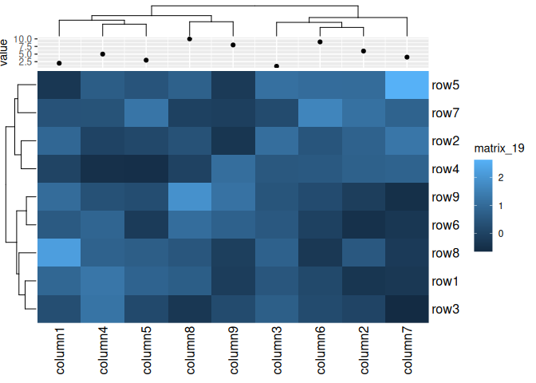

Legends will also be extracted, in the similar manner like passing them
into `annotation_legend_list` argument.

``` r
draw(ggheat(small_mat,
  top_annotation = eheat_anno(
    foo = gganno(
      data = anno_data,
      function(p) {
        p + geom_bar(aes(y = value, fill = factor(.row_index)), stat = "identity")
      }, size = unit(5, "cm")
    )
  )
), merge_legends = TRUE)
#> ℹ convert simple vector to one-column matrix
```

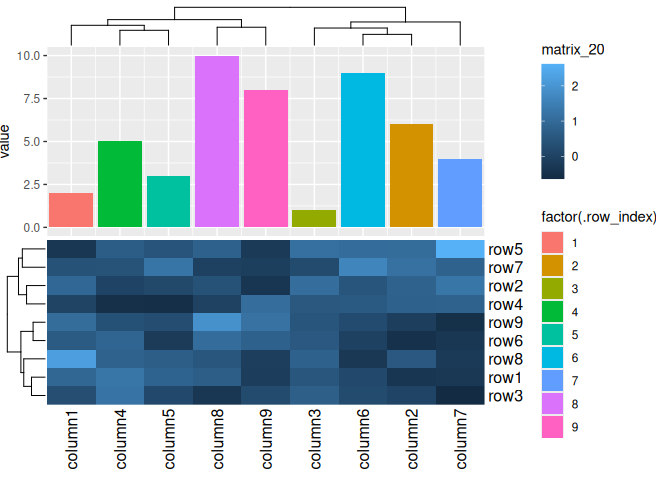

``` r
draw(ggheat(small_mat,
  top_annotation = eheat_anno(
    foo = gganno(
      data = anno_data,
      function(p) {
        p + geom_boxplot(aes(y = value, fill = factor(.slice)))
      }, size = unit(5, "cm")
    )
  ), column_km = 2L
), merge_legends = TRUE)
#> ℹ convert simple vector to one-column matrix
```

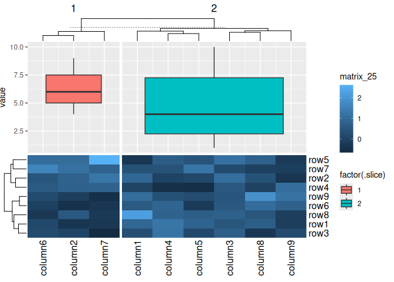

``` r
box_matrix1 <- matrix(rnorm(ncol(small_mat)^2L, 10), nrow = ncol(small_mat))
colnames(box_matrix1) <- rep_len("group1", ncol(small_mat))
box_matrix2 <- matrix(rnorm(ncol(small_mat)^2L, 20), nrow = ncol(small_mat))
colnames(box_matrix2) <- rep_len("group2", ncol(small_mat))
draw(ggheat(small_mat,
  top_annotation = eheat_anno(
    foo = gganno(
      data = cbind(box_matrix1, box_matrix2),
      function(p) {
        p +
          geom_violin(
            aes(
              y = value, fill = factor(.column_names),
              color = factor(.slice),
              group = paste(.slice, .row_index, .column_names, sep = "-")
            )
          ) +
          geom_boxplot(
            aes(
              y = value, fill = factor(.column_names),
              color = factor(.slice),
              group = paste(.slice, .row_index, .column_names, sep = "-")
            ),
            width = 0.2,
            position = position_dodge(width = 0.9)
          ) +
          scale_fill_brewer(
            name = "Group", type = "qual", palette = "Set3"
          ) +
          scale_color_brewer(
            name = "Slice", type = "qual", palette = "Set1"
          )
      }, size = unit(3, "cm")
    )
  ), column_km = 2L
), merge_legends = TRUE)
```

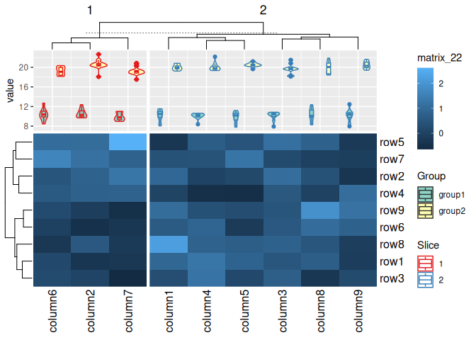

``` r
draw(ggheat(small_mat,
  top_annotation = eheat_anno(
    foo = gganno(
      data = anno_data,
      function(p) {
        p + aes(y = value) + geom_text(aes(label = .row_index))
      }, size = unit(2, "cm")
    )
  ),
  bottom_annotation = eheat_anno(
    foo = gganno(
      function(p) {
        p + aes(y = value) +
          geom_text(aes(label = .row_index)) +
          scale_y_reverse()
      },
      data = anno_data,
      size = unit(2, "cm")
    )
  ),
  right_annotation = eheat_anno(
    foo = gganno(
      function(p) {
        p + aes(x = value) +
          geom_text(aes(label = .row_index))
      },
      data = anno_data,
      size = unit(3, "cm")
    )
  ),
  left_annotation = eheat_anno(
    foo = gganno(
      function(p) {
        p + aes(x = value) +
          geom_text(aes(label = .row_index)) +
          scale_x_reverse()
      },
      data = anno_data,
      size = unit(3, "cm")
    )
  ),
  row_km = 2L, column_km = 2L,
), merge_legends = TRUE)
#> ℹ convert simple vector to one-column matrix
#> ℹ convert simple vector to one-column matrix
#> ℹ convert simple vector to one-column matrix
#> ℹ convert simple vector to one-column matrix
```

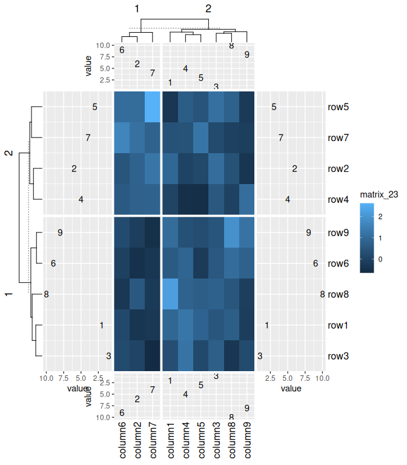

`gganno` can work with `Heatmap` function, in this way, legends won’t be
extracted. In general, we should just use `ggheat` and `gganno`.

``` r
draw(ComplexHeatmap::Heatmap(small_mat,
  top_annotation = eheat_anno(
    foo = gganno(
      data = anno_data,
      function(p) {
        p + geom_bar(aes(y = value, fill = factor(.row_index)), stat = "identity")
      }
    )
  )
), merge_legends = TRUE)
#> ℹ convert simple vector to one-column matrix
```

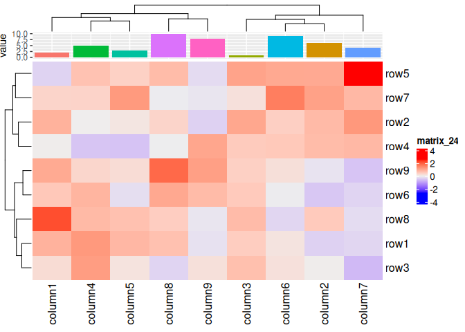

## `anno_gg` and `anno_gg2`

Both function acts similar with other annotation function in
ComplexHeatmap. They accept a ggplot object and fit it in the
ComplexHeatmap annotation area.

``` r
g <- ggplot(mpg, aes(displ, hwy, colour = class)) +
  geom_point()
m <- matrix(rnorm(100), 10)

# anno_gg-panel: clip = "off" -------
ggheat(m,
  top_annotation = eheat_anno(
    ggplot = anno_gg(g, "panel",
      clip = "off",
      size = unit(3, "cm"),
      show_name = FALSE
    )
  )
)
```

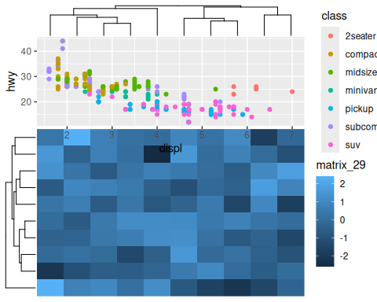

``` r
# anno_gg-panel: clip = "on" --------
ggheat(m,
  top_annotation = eheat_anno(
    ggplot = anno_gg(g, "panel",
      clip = "on",
      size = unit(3, "cm"),
      show_name = FALSE
    )
  )
)
```


``` r
# anno_gg-plot --------------------
ggheat(m,
  top_annotation = eheat_anno(
    ggplot = anno_gg(g, "plot",
      size = unit(3, "cm"),
      show_name = FALSE
    )
  )
)
```

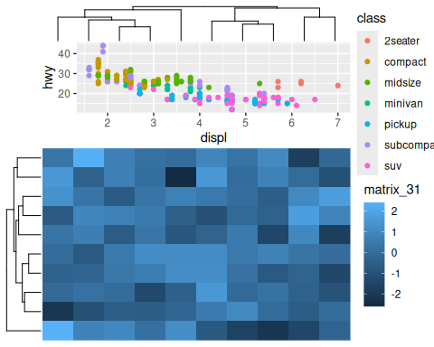

``` r

# anno_gg-full --------------------
ggheat(m,
  top_annotation = eheat_anno(
    ggplot = anno_gg(g, "full",
      size = unit(3, "cm"),
      show_name = FALSE
    )
  )
)
```

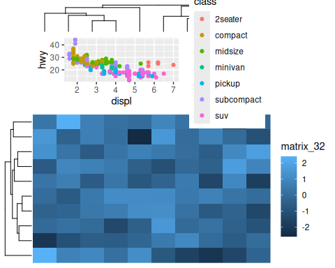

`anno_gg2` is the same with `anno_gg`, it differs in terms of its
arguments, and allow more precise adjustment of the clip feature.

``` r
# anno_gg2-panel: margins = NULL -------
ggheat(m,
  top_annotation = eheat_anno(
    ggplot = anno_gg2(g, "panel",
      margins = NULL,
      size = unit(3, "cm"),
      show_name = FALSE
    )
  )
)
```

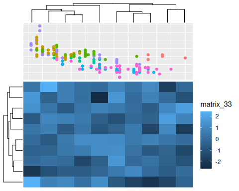

``` r
# anno_gg2-panel: margins = "l" --------
ggheat(m,
  top_annotation = eheat_anno(
    ggplot = anno_gg2(g, "panel",
      margins = "l",
      size = unit(3, "cm"),
      show_name = FALSE
    )
  )
)
```

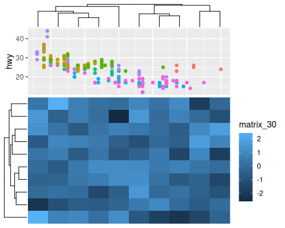

``` r
# anno_gg2-panel: margins = "r" --------
ggheat(m,
  top_annotation = eheat_anno(
    ggplot = anno_gg2(g, "panel",
      margins = "r",
      size = unit(3, "cm"),
      show_name = FALSE
    )
  )
)
```

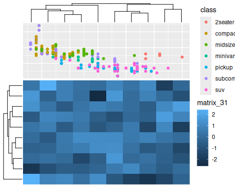

``` r
# anno_gg2-plot ---------------------
ggheat(m,
  top_annotation = eheat_anno(
    ggplot = anno_gg2(g, "plot",
      size = unit(3, "cm"),
      show_name = FALSE
    )
  )
)
```

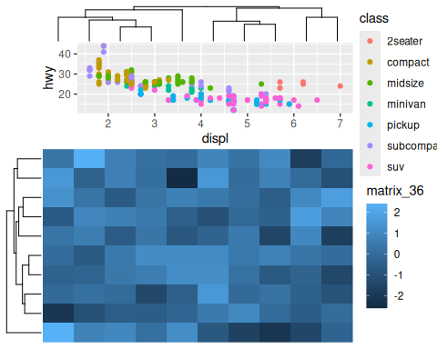

``` r
# anno_gg2-full --------------------
ggheat(m,
  top_annotation = eheat_anno(
    ggplot = anno_gg2(
      g + guides(colour = guide_legend(
        theme = theme(
          legend.key.size = unit(1, "mm"),
          legend.text = element_text(size = 10),
          legend.key.spacing = unit(0, "mm"),
          legend.title.position = "bottom",
          legend.key = element_blank()
        ),
        ncol = 2L
      )),
      align_with = "full",
      size = unit(3, "cm"),
      show_name = FALSE
    )
  )
)
```

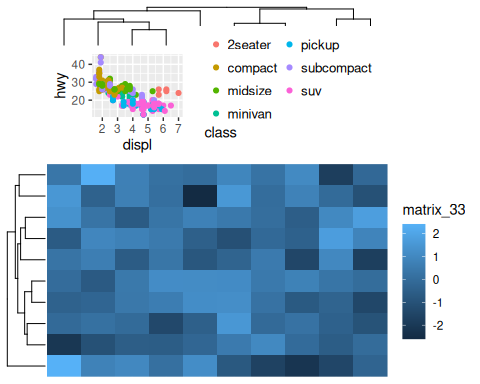

## Session information

``` r
sessionInfo()
#> R version 4.4.0 (2024-04-24)
#> Platform: x86_64-pc-linux-gnu
#> Running under: Ubuntu 24.04 LTS
#> 
#> Matrix products: default
#> BLAS/LAPACK: /usr/lib/x86_64-linux-gnu/libmkl_rt.so;  LAPACK version 3.8.0
#> 
#> locale:
#>  [1] LC_CTYPE=C.UTF-8       LC_NUMERIC=C           LC_TIME=C.UTF-8       
#>  [4] LC_COLLATE=C.UTF-8     LC_MONETARY=C.UTF-8    LC_MESSAGES=C.UTF-8   
#>  [7] LC_PAPER=C.UTF-8       LC_NAME=C              LC_ADDRESS=C          
#> [10] LC_TELEPHONE=C         LC_MEASUREMENT=C.UTF-8 LC_IDENTIFICATION=C   
#> 
#> time zone: Asia/Shanghai
#> tzcode source: system (glibc)
#> 
#> attached base packages:
#> [1] stats     graphics  grDevices utils     datasets  methods   base     
#> 
#> other attached packages:
#> [1] eheat_0.99.8  ggplot2_3.5.1
#> 
#> loaded via a namespace (and not attached):
#>  [1] tidyr_1.3.1           utf8_1.2.4            generics_0.1.3       
#>  [4] shape_1.4.6.1         digest_0.6.36         magrittr_2.0.3       
#>  [7] evaluate_0.24.0       grid_4.4.0            RColorBrewer_1.1-3   
#> [10] iterators_1.0.14      circlize_0.4.16       fastmap_1.2.0        
#> [13] foreach_1.5.2         doParallel_1.0.17     GlobalOptions_0.1.2  
#> [16] ComplexHeatmap_2.20.0 purrr_1.0.2           fansi_1.0.6          
#> [19] viridisLite_0.4.2     scales_1.3.0          codetools_0.2-20     
#> [22] cli_3.6.3             rlang_1.1.4           crayon_1.5.3         
#> [25] munsell_0.5.1         withr_3.0.0           yaml_2.3.8           
#> [28] ggh4x_0.2.8           tools_4.4.0           parallel_4.4.0       
#> [31] dplyr_1.1.4           colorspace_2.1-0      GetoptLong_1.0.5     
#> [34] BiocGenerics_0.50.0   vctrs_0.6.5           R6_2.5.1             
#> [37] png_0.1-8             magick_2.8.3          matrixStats_1.3.0    
#> [40] stats4_4.4.0          lifecycle_1.0.4       S4Vectors_0.42.0     
#> [43] IRanges_2.38.0        clue_0.3-65           cluster_2.1.6        
#> [46] pkgconfig_2.0.3       pillar_1.9.0          gtable_0.3.5         
#> [49] Rcpp_1.0.12           glue_1.7.0            highr_0.11           
#> [52] xfun_0.45             tibble_3.2.1          tidyselect_1.2.1     
#> [55] knitr_1.47            farver_2.1.2          rjson_0.2.21         
#> [58] htmltools_0.5.8.1     labeling_0.4.3        rmarkdown_2.27       
#> [61] Cairo_1.6-2           compiler_4.4.0
```
