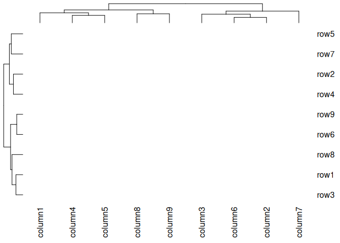
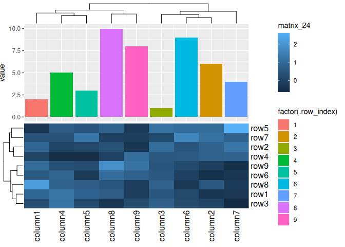
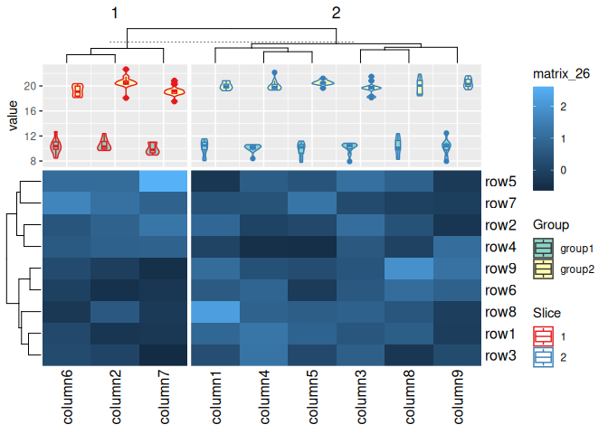
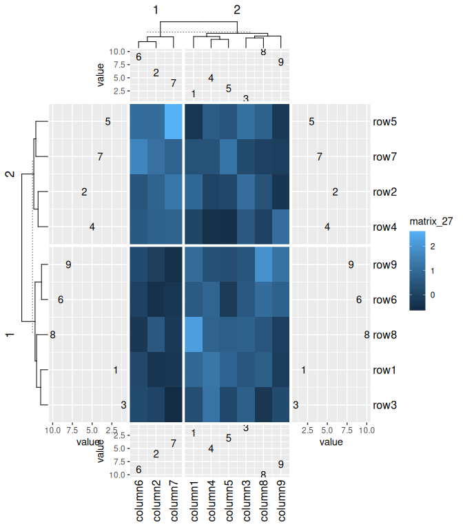
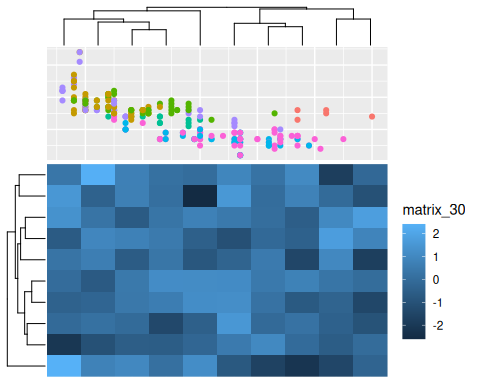
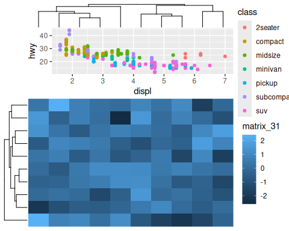
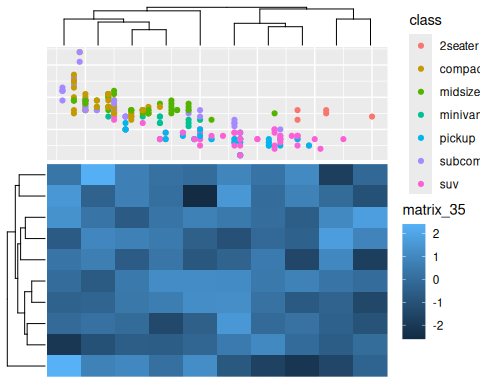
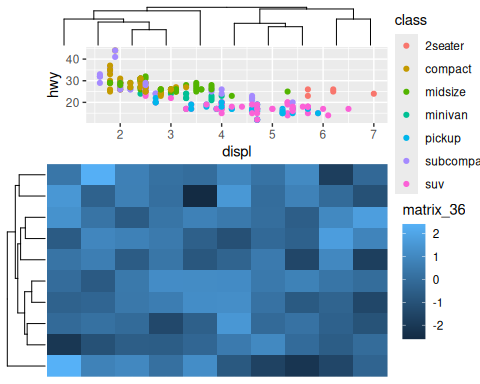
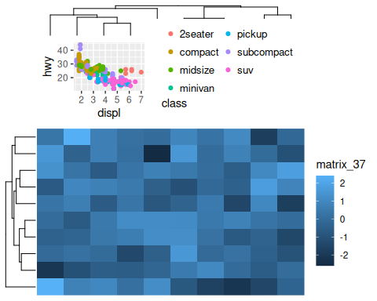

由chatgpt-3.5翻译

- [eheat](#eheat)
  - [安装](#安装)
  - [`ggheat`](#ggheat)
  - [`gganno`](#gganno)
  - [`anno_gg` 和 `anno_gg2`](#anno_gg-和-anno_gg2)
  - [Session information](#session-information)

<!-- README.md is generated from README.Rmd. Please edit that file -->

# eheat

<!-- badges: start -->

[](https://github.com/Yunuuuu/eheat/actions/workflows/R-CMD-check.yaml)
<!-- badges: end -->

*在其他语言中阅读：[English](README.md),
[简体中文](README.zh-cn.md)*

这个包用作 [ggplot2](https://ggplot2.tidyverse.org/) 和
[ComplexHeatmap](https://github.com/jokergoo/ComplexHeatmap) 之间的桥梁。
基本上，通过 `eheat` 包，可以在`ComplexHeatmap`中使用除facet面板操作（在 `eheat` 包也不应该进行ggplot2 facet操作）以外的所有的`ggplot2`操作(包括geoms,stats,guides,themes)。幸运的是，ComplexHeatmap 能够很好地处理facet面板操作。

## 安装

您可以使用以下代码从 [GitHub](https://github.com/) 安装 `eheat` 的开发版本：

``` r
if (!requireNamespace("pak")) {
  install.packages("pak",
    repos = sprintf(
      "https://r-lib.github.io/p/pak/devel/%s/%s/%s",
      .Platform$pkgType, R.Version()$os, R.Version()$arch
    )
  )
}
pak::pkg_install("Yunuuuu/eheat")
```

``` r
library(eheat)
#> Loading required package: ggplot2
```

让我们从创建一些示例数据开始，以下代码直接从 ComplexHeatmap 书中复制：

``` r
set.seed(123)
nr1 <- 4
nr2 <- 8
nr3 <- 6
nr <- nr1 + nr2 + nr3
nc1 <- 6
nc2 <- 8
nc3 <- 10
nc <- nc1 + nc2 + nc3
mat <- cbind(
  rbind(
    matrix(rnorm(nr1 * nc1, mean = 1, sd = 0.5), nrow = nr1),
    matrix(rnorm(nr2 * nc1, mean = 0, sd = 0.5), nrow = nr2),
    matrix(rnorm(nr3 * nc1, mean = 0, sd = 0.5), nrow = nr3)
  ),
  rbind(
    matrix(rnorm(nr1 * nc2, mean = 0, sd = 0.5), nrow = nr1),
    matrix(rnorm(nr2 * nc2, mean = 1, sd = 0.5), nrow = nr2),
    matrix(rnorm(nr3 * nc2, mean = 0, sd = 0.5), nrow = nr3)
  ),
  rbind(
    matrix(rnorm(nr1 * nc3, mean = 0.5, sd = 0.5), nrow = nr1),
    matrix(rnorm(nr2 * nc3, mean = 0.5, sd = 0.5), nrow = nr2),
    matrix(rnorm(nr3 * nc3, mean = 1, sd = 0.5), nrow = nr3)
  )
)
mat <- mat[sample(nr, nr), sample(nc, nc)] # 随机重排行和列的顺序
rownames(mat) <- paste0("第", seq_len(nr), "行")
colnames(mat) <- paste0("第", seq_len(nc), "列")
small_mat <- mat[1:9, 1:9]
```

`eheat`包的核心组件是`ggheat`和`gganno`函数，它们包含所有必要的功能。`ggheat`函数作为`ComplexHeatmap::Heatmap`函数的替代，而`gganno`替代了`ComplexHeatmap`包中的`anno_*`函数，为我们的需求提供了全面的解决方案。在`ComplexHeatmap`中使用`ggplot2`的一个重要优点是能够轻松地绘制统计注释。另一个好处是图例可以从`ggplot2`对象中提取出来，省去手动添加图例的需要。此外，`eheat`包还提供`eheat_anno`函数，它是`HeatmapAnnotation`函数的对应函数。当与`ggheat`函数一起使用时，该函数具有自动猜测`which`参数的优点。


## `ggheat`

使用`ggheat`，创建一个简单的热图非常容易。默认的颜色映射在ComplexHeatmap和ggplot2之间不一致。

``` r
draw(ggheat(small_mat))
```


您不需要显式指定颜色映射，因为可以直接使用ggplot2中的`scale_*`函数。所有的导航图例都将直接从`ggplot2`中提取出来。`ggheat`的核心参数是`ggfn`，它接受一个具有默认数据和映射的ggplot2对象，该对象由`ggplot(data, aes(.data$x, .data$y))`创建。数据包含以下列：

- `.slice`：切片编号，将`.slice_row`和`.slice_column`组合起来。

- `.slice_row`：切片的行号

- `.slice_column`：切片的列号

- `.row_names` 和 `.column_names`：原矩阵的行和列名称（仅当存在名称时适用）。

- `.row_index` 和 `.column_index`：原矩阵的行和列索引。

- `x` 和 `y`：`x`和`y`坐标

- `value`：热图矩阵的实际值。

``` r
pdf(NULL)
draw(ggheat(small_mat, function(x) {
  print(head(x$data))
  x
}))
#>   .slice .slice_row .slice_column .row_names .column_names .row_index
#> 1   r1c1          1             1       row1       column1          1
#> 2   r1c1          1             1       row1       column2          1
#> 3   r1c1          1             1       row1       column3          1
#> 4   r1c1          1             1       row1       column4          1
#> 5   r1c1          1             1       row1       column5          1
#> 6   r1c1          1             1       row1       column6          1
#>   .column_index x y      value
#> 1             1 1 2  0.9047416
#> 2             2 8 2 -0.3522982
#> 3             3 6 2  0.5016096
#> 4             4 2 2  1.2676994
#> 5             5 3 2  0.8251229
#> 6             6 7 2  0.1621522
dev.off()
#> png 
#>   2
```

富有的 `scale_*` 函数在 ggplot2 中使修改颜色映射变得容易。

``` r
draw(ggheat(small_mat, function(p) {
  # 将使用零点作为中点
  p + scale_fill_gradient2()
}))
```


``` r
draw(ggheat(small_mat, function(p) {
  p + scale_fill_viridis_c(option = "magma")
}))
```


图例可以通过 ggplot2 中的 `guide_*` 函数进行控制。

``` r
draw(ggheat(small_mat, function(p) {
  p + scale_fill_viridis_c(guide = guide_colorbar(direction = "horizontal"))
}))
```


您可以添加更多的几何对象。

``` r
draw(
  ggheat(small_mat, function(p) {
    p +
      geom_text(aes(label = sprintf("%d * %d", .row_index, .column_index)))
  })
)
```


您也可以使用 ComplexHeatmap 中的相同方式，通过设置 `rect_gp = gpar(type = "none")` 来防止内部矩形填充。聚类仍然应用，但在热图主体上不绘制任何内容。

``` r
draw(ggheat(small_mat, rect_gp = gpar(type = "none")))
```



请注意 ggplot2 和 ComplexHeatmap 之间的背景是不同的。然而，ggplot2 中的主题系统使得修改和自定义背景变得容易。

``` r
draw(
  ggheat(small_mat, function(p) {
    p +
      geom_text(aes(label = sprintf("%d * %d", .row_index, .column_index))) +
      theme_bw()
  }, rect_gp = gpar(type = "none"))
)
```


您可以使用 `geom_tile` 轻松自定义热图填充。

``` r
draw(
  ggheat(small_mat, function(p) {
    p +
      geom_tile(
        aes(fill = value),
        width = 1L, height = 1L,
        data = ~ dplyr::filter(.x, y <= x)
      ) +
      geom_text(
        aes(label = sprintf("%d * %d", .row_index, .column_index)),
        data = ~ dplyr::filter(.x, y >= x)
      ) +
      theme_bw()
  }, rect_gp = gpar(type = "none"))
)
```


`ComplexHeatmap::Heatmap` 函数的所有功能都可以直接使用。

``` r
draw(ggheat(small_mat, function(p) {
  p + scale_fill_viridis_c()
}, column_km = 2L))
```


``` r
draw(ggheat(small_mat, function(p) {
  p + scale_fill_viridis_c()
}, column_km = 2L, row_km = 3))
```


``` r
draw(ggheat(small_mat, function(p) {
  p +
    geom_text(aes(label = sprintf("%d * %d", .row_index, .column_index))) +
    scale_fill_viridis_c()
}, column_km = 2L, row_km = 3))
```


我们可以将 ComplexHeatmap 的 `layer_fun` 或 `cell_fun` 与 `ggfn` 结合使用

``` r
draw(
  ggheat(small_mat,
    layer_fun = function(...) {
      grid::grid.rect(gp = gpar(lwd = 2, fill = "transparent", col = "red"))
    }, column_km = 2L, row_km = 3
  )
)
```


`ggheat` 只会接管热图主体和图例。行名和列名由 `ComplexHeatmap::Heatmap` 函数控制。

``` r
draw(ggheat(small_mat, function(p) {
  p + scale_fill_viridis_c()
}, column_km = 2L, row_km = 3, row_names_gp = gpar(col = "red")))
```


# 这是一个Markdown文件

虽然图例由`ggplot2`控制，但默认的图例名称取自`ComplexHeatmap::Heatmap`，以保持一致性。

``` r
draw(
  ggheat(small_mat, function(p) {
    p + scale_fill_viridis_c()
  },
  column_km = 2L, row_km = 3, row_names_gp = gpar(col = "red"),
  name = "ComplexHeatmap"
  )
)
```


然而，您可以直接在`ggfn`中覆盖它。

``` r
draw(
  ggheat(small_mat, function(p) {
    p + scale_fill_viridis_c(name = "ggplot2")
  },
  column_km = 2L, row_km = 3, row_names_gp = gpar(col = "red"),
  name = "ComplexHeatmap"
  )
)
```


内部图例将保留在热图主体面板中，因为这种类型的图例应该由用户有意放置，所以`ggheat`将不会在集合中包含它。

``` r
draw(
  ggheat(small_mat, function(p) {
    p +
      geom_tile(
        aes(fill = value),
        width = 1L, height = 1L,
        data = ~ dplyr::filter(.x, y <= x)
      ) +
      theme_bw() +
      theme(
        legend.position = "inside",
        legend.position.inside = c(0.2, 0.3)
      )
  }, rect_gp = gpar(type = "none"), column_km = 2L, row_km = 3)
)
```


## `gganno`

与`ggheat`类似，`gganno`的基本参数也是`ggfn`，它接受一个带有默认数据和映射的ggplot2对象，该对象由`ggplot(data, aes(.data$x))`（`which`=`"column"`）/ `ggplot(data, ggplot2::aes(y = .data$y))`（`which`=`"row"`）创建。

如果原始数据是一个矩阵，则将其转换为长格式的数据框在`ggplot2`图形数据中。最终的ggplot2图形数据将包含以下列：

- `.slice`：切片的行（`which`=`"row"`）或列（`which`=`"column"`）编号。

- `.row_names`和`.row_index`：原始数据的行名称（只适用于存在名称时）和索引。

- `.column_names`和`.column_index`：原始数据的列名称（只适用于存在名称时）和索引（仅适用于原始数据是一个矩阵的情况）。

- `x` / `y`：指示x轴（或y轴）坐标。请不要使用`coord_flip`来翻转坐标，因为它可能会破坏内部操作。

- `value`：注释矩阵的实际矩阵值（仅适用于原始数据是一个矩阵的情况）。

`gganno`可以与`ggheat`和`ComplexHeatmap::Heatmap`无缝结合，尽管在后一种情况下不会提取图例。

如果提供了一个矩阵，它将转换为长格式的数据框

``` r
pdf(NULL)
draw(ggheat(small_mat,
  top_annotation = eheat_anno(
    foo = gganno(
      data = matrix(1:10, nrow = nrow(small_mat)),
      function(p) {
        print(head(p$data))
        p
      }
    )
  )
))
#> Warning in matrix(1:10, nrow = nrow(small_mat)): data length [10] is not a
#> sub-multiple or multiple of the number of rows [9]
#>   .slice .row_index .column_index x value
#> 1      1          1             1 1     1
#> 2      1          1             2 1    10
#> 3      1          2             1 8     2
#> 4      1          2             2 8     1
#> 5      1          3             1 6     3
#> 6      1          3             2 6     2
```

``` r
dev.off()
#> png 
#>   2
```

如果提供了一个数据框，它将以其原始形式保留，并添加额外的必要列。

``` r
pdf(NULL)
draw(ggheat(small_mat,
  top_annotation = eheat_anno(
    foo = gganno(
      data = data.frame(
        value = seq_len(nrow(small_mat)),
        letter = sample(letters, nrow(small_mat), replace = TRUE)
      ),
      function(p) {
        print(head(p$data))
        p
      }
    )
  )
))
#>   .slice .row_names .row_index x value letter
#> 1      1          1          1 1     1      w
#> 2      1          2          2 8     2      r
#> 3      1          3          3 6     3      l
#> 4      1          4          4 2     4      r
#> 5      1          5          5 3     5      g
#> 6      1          6          6 7     6      z
```

``` r
dev.off()
#> png 
#>   2
```

如果提供一个原子向量，则它将被转换为矩阵，然后转换为长格式的数据框。

这是一个Markdown文件，请将其翻译成中文，不要修改现有的Markdown命令：

``` r
pdf(NULL)
draw(ggheat(small_mat,
  top_annotation = eheat_anno(
    foo = gganno(
      data = sample(1:10, nrow(small_mat)),
      function(p) {
        print(head(p$data))
        p
      }
    )
  )
))
#> ℹ convert simple vector to one-column matrix
#>   .slice .column_names .row_index .column_index x value
#> 1      1            V1          1             1 1     9
#> 2      1            V1          2             1 8     3
#> 3      1            V1          3             1 6     1
#> 4      1            V1          4             1 2    10
#> 5      1            V1          5             1 3     7
#> 6      1            V1          6             1 7     6
```

``` r
dev.off()
#> png 
#>   2
```

如果未提供数据，则将使用热图矩阵，矩阵也是如此（重塑为长格式数据帧）。注意：对于列注释，热图矩阵将被转置，因为`gganno`始终将行视为观察结果。

``` r
pdf(NULL)
draw(ggheat(small_mat,
  top_annotation = eheat_anno(
    foo = gganno(
      data = NULL,
      function(p) {
        print(head(p$data))
        p
      }
    )
  )
))
#>   .slice .row_names .column_names .row_index .column_index x       value
#> 1      1    column1          row1          1             1 1  0.90474160
#> 2      1    column1          row2          1             2 1  0.90882972
#> 3      1    column1          row3          1             3 1  0.28074668
#> 4      1    column1          row4          1             4 1  0.02729558
#> 5      1    column1          row5          1             5 1 -0.32552445
#> 6      1    column1          row6          1             6 1  0.58403269
```

``` r
dev.off()
#> png 
#>   2
```

``` r
pdf(NULL)
draw(ggheat(small_mat,
  left_annotation = eheat_anno(
    foo = gganno(
      data = NULL,
      function(p) {
        print(head(p$data))
        p
      }
    )
  )
))
#>   .slice .row_names .column_names .row_index .column_index y      value
#> 1      1       row1       column6          1             6 2  0.1621522
#> 2      1       row1       column9          1             9 2 -0.1629658
#> 3      1       row1       column1          1             1 2  0.9047416
#> 4      1       row1       column7          1             7 2 -0.2869867
#> 5      1       row1       column8          1             8 2  0.6803262
#> 6      1       row1       column4          1             4 2  1.2676994
```

``` r
dev.off()
#> png 
#>   2
```

您还可以在数据中提供一个函数（也可以使用purrr-lambda），该函数将应用于热图矩阵。注意：对于列注释，热图矩阵将在传入此函数之前转置。

``` r
pdf(NULL)
draw(ggheat(small_mat,
  top_annotation = eheat_anno(
    foo = gganno(
      data = function(x) {
        if (identical(x, small_mat)) {
          print("矩阵未转置")
        } else if (identical(x, t(small_mat))) {
          print("矩阵转置")
        }
        rowSums(x)
      }
    ),
    which = "column"
  )
))
#> [1] "矩阵转置"
#> ℹ convert simple vector to one-column matrix
```

``` r
dev.off()
#> png 
#>   2
```

``` r
pdf(NULL)
draw(ggheat(small_mat,
  left_annotation = eheat_anno(
    foo = gganno(
      data = function(x) {
        if (identical(x, small_mat)) {
          print("矩阵未转置")
        } else if (identical(x, t(small_mat))) {
          print("矩阵转置")
        }
        rowSums(x)
      }
    )
  )
))
#> [1] "矩阵未转置"
#> ℹ convert simple vector to one-column matrix
```

``` r
dev.off()
#> png 
#>   2
```

类似地，我们可以利用`ggfn`中提供的ggplot2中的几何对象（geoms）来创建注释。

``` r
anno_data <- sample(1:10, nrow(small_mat))
draw(ggheat(small_mat,
  top_annotation = eheat_anno(
    foo = gganno(
      data = anno_data,
      function(p) {
        p + geom_point(aes(x, value))
      }
    )
  )
))
#> ℹ convert simple vector to one-column matrix
```


#> 绘制由gganno生成的注释

图例也将被提取，类似地，传入`annotation_legend_list`参数。

```r
draw(ggheat(small_mat,
  top_annotation = eheat_anno(
    foo = gganno(
      data = anno_data,
      function(p) {
        p + geom_bar(aes(y = value, fill = factor(.row_index)), stat = "identity")
      }, size = unit(5, "cm")
    )
  )
), merge_legends = TRUE)
#> ℹ 将简单向量转换为一列矩阵
```



```r
draw(ggheat(small_mat,
  top_annotation = eheat_anno(
    foo = gganno(
      data = anno_data,
      function(p) {
        p + geom_boxplot(aes(y = value, fill = factor(.slice)))
      }, size = unit(5, "cm")
    )
  ), column_km = 2L
), merge_legends = TRUE)
#> ℹ 将简单向量转换为一列矩阵
```


```r
box_matrix1 <- matrix(rnorm(ncol(small_mat)^2L, 10), nrow = ncol(small_mat))
colnames(box_matrix1) <- rep_len("group1", ncol(small_mat))
box_matrix2 <- matrix(rnorm(ncol(small_mat)^2L, 20), nrow = ncol(small_mat))
colnames(box_matrix2) <- rep_len("group2", ncol(small_mat))
draw(ggheat(small_mat,
  top_annotation = eheat_anno(
    foo = gganno(
      data = cbind(box_matrix1, box_matrix2),
      function(p) {
        p +
          geom_violin(
            aes(
              y = value, fill = factor(.column_names),
              color = factor(.slice),
              group = paste(.slice, .row_index, .column_names, sep = "-")
            )
          ) +
          geom_boxplot(
            aes(
              y = value, fill = factor(.column_names),
              color = factor(.slice),
              group = paste(.slice, .row_index, .column_names, sep = "-")
            ),
            width = 0.2,
            position = position_dodge(width = 0.9)
          ) +
          scale_fill_brewer(
            name = "Group", type = "qual", palette = "Set3"
          ) +
          scale_color_brewer(
            name = "Slice", type = "qual", palette = "Set1"
          )
      }, size = unit(3, "cm")
    )
  ), column_km = 2L
), merge_legends = TRUE)
```



``` r
draw(ggheat(small_mat,
  top_annotation = eheat_anno(
    foo = gganno(
      data = anno_data,
      function(p) {
        p + aes(y = value) + geom_text(aes(label = .row_index))
      }, size = unit(2, "cm")
    )
  ),
  bottom_annotation = eheat_anno(
    foo = gganno(
      function(p) {
        p + aes(y = value) +
          geom_text(aes(label = .row_index)) +
          scale_y_reverse()
      },
      data = anno_data,
      size = unit(2, "cm")
    )
  ),
  right_annotation = eheat_anno(
    foo = gganno(
      function(p) {
        p + aes(x = value) +
          geom_text(aes(label = .row_index))
      },
      data = anno_data,
      size = unit(3, "cm")
    )
  ),
  left_annotation = eheat_anno(
    foo = gganno(
      function(p) {
        p + aes(x = value) +
          geom_text(aes(label = .row_index)) +
          scale_x_reverse()
      },
      data = anno_data,
      size = unit(3, "cm")
    )
  ),
  row_km = 2L, column_km = 2L,
), merge_legends = TRUE)
#> ℹ convert simple vector to one-column matrix
#> ℹ convert simple vector to one-column matrix
#> ℹ convert simple vector to one-column matrix
#> ℹ convert simple vector to one-column matrix
```



`gganno` 可以与 `Heatmap` 函数配合使用，这样，图例将不会被提取。通常情况下，我们应该使用 `ggheat` 和 `gganno`。

``` r
draw(ComplexHeatmap::Heatmap(small_mat,
  top_annotation = eheat_anno(
    foo = gganno(
      data = anno_data,
      function(p) {
        p + geom_bar(aes(y = value, fill = factor(.row_index)), stat = "identity")
      }
    )
  )
), merge_legends = TRUE)
#> ℹ convert simple vector to one-column matrix
```


## `anno_gg` and `anno_gg2`

这两个函数与ComplexHeatmap中的其他注释函数类似。它们接受一个ggplot对象，并将其适应到ComplexHeatmap注释区域。

``` r
g <- ggplot(mpg, aes(displ, hwy, colour = class)) +
  geom_point()
m <- matrix(rnorm(100), 10)

# anno_gg-panel: clip = "off" -------
ggheat(m,
  top_annotation = eheat_anno(
    ggplot = anno_gg(g, "panel",
      clip = "off",
      size = unit(3, "cm"),
      show_name = FALSE
    )
  )
)
```


``` r
# anno_gg-panel: clip = "on" --------
ggheat(m,
  top_annotation = eheat_anno(
    ggplot = anno_gg(g, "panel",
      clip = "on",
      size = unit(3, "cm"),
      show_name = FALSE
    )
  )
)
```



``` r
# anno_gg-plot --------------------
ggheat(m,
  top_annotation = eheat_anno(
    ggplot = anno_gg(g, "plot",
      size = unit(3, "cm"),
      show_name = FALSE
    )
  )
)
```



``` r

# anno_gg-full --------------------
ggheat(m,
  top_annotation = eheat_anno(
    ggplot = anno_gg(g, "full",
      size = unit(3, "cm"),
      show_name = FALSE
    )
  )
)
```


`anno_gg2` 与 `anno_gg` 相同，只是在参数上有所不同，并允许更精确地调整剪切功能。

``` r
# anno_gg2-panel: margins = NULL -------
ggheat(m,
  top_annotation = eheat_anno(
    ggplot = anno_gg2(g, "panel",
      margins = NULL,
      size = unit(3, "cm"),
      show_name = FALSE
    )
  )
)
```


```r
# anno_gg2-panel: margins = "l" --------
ggheat(m,
  top_annotation = eheat_anno(
    ggplot = anno_gg2(g, "panel",
      margins = "l",
      size = unit(3, "cm"),
      show_name = FALSE
    )
  )
)
```


```r
# anno_gg2-panel: margins = "r" --------
ggheat(m,
  top_annotation = eheat_anno(
    ggplot = anno_gg2(g, "panel",
      margins = "r",
      size = unit(3, "cm"),
      show_name = FALSE
    )
  )
)
```



```r
# anno_gg2-plot ---------------------
ggheat(m,
  top_annotation = eheat_anno(
    ggplot = anno_gg2(g, "plot",
      size = unit(3, "cm"),
      show_name = FALSE
    )
  )
)
```



```r
# anno_gg2-full --------------------
ggheat(m,
  top_annotation = eheat_anno(
    ggplot = anno_gg2(
      g + guides(colour = guide_legend(
        theme = theme(
          legend.key.size = unit(1, "mm"),
          legend.text = element_text(size = 10),
          legend.key.spacing = unit(0, "mm"),
          legend.title.position = "bottom",
          legend.key = element_blank()
        ),
        ncol = 2L
      )),
      align_with = "full",
      size = unit(3, "cm"),
      show_name = FALSE
    )
  )
)
```



## Session information

``` r
sessionInfo()
#> R version 4.4.0 (2024-04-24)
#> Platform: x86_64-pc-linux-gnu
#> Running under: Ubuntu 24.04 LTS
#> 
#> Matrix products: default
#> BLAS/LAPACK: /usr/lib/x86_64-linux-gnu/libmkl_rt.so;  LAPACK version 3.8.0
#> 
#> locale:
#>  [1] LC_CTYPE=C.UTF-8       LC_NUMERIC=C           LC_TIME=C.UTF-8       
#>  [4] LC_COLLATE=C.UTF-8     LC_MONETARY=C.UTF-8    LC_MESSAGES=C.UTF-8   
#>  [7] LC_PAPER=C.UTF-8       LC_NAME=C              LC_ADDRESS=C          
#> [10] LC_TELEPHONE=C         LC_MEASUREMENT=C.UTF-8 LC_IDENTIFICATION=C   
#> 
#> time zone: Asia/Shanghai
#> tzcode source: system (glibc)
#> 
#> attached base packages:
#> [1] grid      stats     graphics  grDevices utils     datasets  methods  
#> [8] base     
#> 
#> other attached packages:
#> [1] eheat_0.99.8          ggplot2_3.5.1         ComplexHeatmap_2.20.0
#> 
#> loaded via a namespace (and not attached):
#>  [1] utf8_1.2.4          generics_0.1.3      tidyr_1.3.1        
#>  [4] shape_1.4.6.1       digest_0.6.36       magrittr_2.0.3     
#>  [7] evaluate_0.24.0     RColorBrewer_1.1-3  iterators_1.0.14   
#> [10] circlize_0.4.16     fastmap_1.2.0       foreach_1.5.2      
#> [13] doParallel_1.0.17   GlobalOptions_0.1.2 purrr_1.0.2        
#> [16] fansi_1.0.6         viridisLite_0.4.2   scales_1.3.0       
#> [19] codetools_0.2-20    cli_3.6.3           rlang_1.1.4        
#> [22] crayon_1.5.3        munsell_0.5.1       withr_3.0.0        
#> [25] yaml_2.3.8          ggh4x_0.2.8         tools_4.4.0        
#> [28] parallel_4.4.0      dplyr_1.1.4         colorspace_2.1-0   
#> [31] GetoptLong_1.0.5    BiocGenerics_0.50.0 vctrs_0.6.5        
#> [34] R6_2.5.1            png_0.1-8           matrixStats_1.3.0  
#> [37] stats4_4.4.0        lifecycle_1.0.4     magick_2.8.3       
#> [40] S4Vectors_0.42.0    IRanges_2.38.0      clue_0.3-65        
#> [43] cluster_2.1.6       pkgconfig_2.0.3     pillar_1.9.0       
#> [46] gtable_0.3.5        glue_1.7.0          Rcpp_1.0.12        
#> [49] highr_0.11          xfun_0.45           tibble_3.2.1       
#> [52] tidyselect_1.2.1    knitr_1.47          farver_2.1.2       
#> [55] rjson_0.2.21        htmltools_0.5.8.1   labeling_0.4.3     
#> [58] rmarkdown_2.27      Cairo_1.6-2         compiler_4.4.0
```
